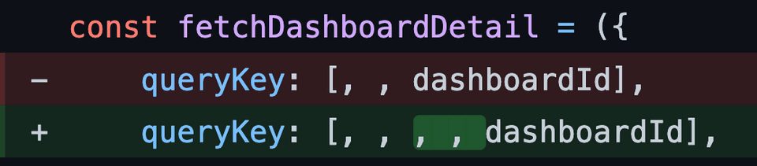

# Использование контекста функции запроса

Мы все стремимся улучшаться как инженеры, и со временем, надеюсь, мы добиваемся успеха в этом начинании. Возможно, мы узнаем новые вещи, которые опровергают или ставят под сомнение наши предыдущие мысли. Или мы осознаем, что шаблоны, которые мы считали идеальными, не масштабируются до того уровня, который нам сейчас нужен.

С момента, когда я впервые начал использовать React Query, прошло уже довольно много времени. Я думаю, что на этом пути я узнал многое, и также "увидел" многое. Я хочу, чтобы мой блог был максимально актуальным, чтобы вы могли вернуться сюда и перечитать его, зная, что концепции по-прежнему актуальны. Это сейчас более актуально, чем когда-либо, так как Таннер Линсли согласился разместить ссылку на мой блог в официальной [документации по React Query](https://tanstack.com/query/latest/docs/framework/react/community/tkdodos-blog).

Поэтому я решил написать это дополнение к моей статье [Эффективное использование ключей в React Query](keys.md). Пожалуйста, убедитесь, что сначала прочтете ее, чтобы понимать, о чем идет речь.

## Hot take {#hot-take}

<div style="text-align: center; border-radius: 8px; border: 2px solid #76c2af; color: #76c2af; padding: 10px; font-weight: bold">
  Не используйте встроенные функции - используйте предоставленный вам контекст функций запроса и фабрику ключей запроса, которая производит ключи объектов.
</div>

Встроенные функции - это, безусловно, самый простой способ передать параметры в ваш `queryFn`, потому что они позволяют вам захватывать другие переменные, доступные в вашем пользовательском хуке. Давайте рассмотрим вечно актуальный пример с задачами:

```ts title="inline-query-fn"
type State = 'all' | 'open' | 'done'
type Todo = {
  id: number
  state: TodoState
}
type Todos = ReadonlyArray<Todo>

const fetchTodos = async (state: State): Promise<Todos> => {
  const response = await axios.get(`todos/${state}`)
  return response.data
}

export const useTodos = () => {
  // Представьте, что здесь происходит захват текущего выбора пользователя
  // откуда-то, например, из url
  const { state } = useTodoParams()

  // ✅ queryFn — это встроенная функция, которая замыкает переданное состояние.
  return useQuery({
    queryKey: ['todos', state],
    queryFn: () => fetchTodos(state),
  })
}
```

Возможно, вы узнаете этот пример - это небольшая вариация [#1: Практический React Query - Обращение с ключом запроса как с массивом зависимостей](practical.md#treat-the-query-key-like-a-dependency-array). Это отлично работает для простых примеров, но у него есть существенная проблема при наличии большого количества параметров. В более крупных приложениях не редко встречаются множество параметров фильтрации и сортировки, и я лично видел передачу до 10 параметров.

Предположим, мы хотим добавить сортировку к нашему запросу. Мне нравится подходить к этим вещам снизу вверх - начиная с `queryFn` и позволяя компилятору сообщать мне, что мне нужно изменить дальше:

```ts title="sorting-todos" hl_lines="1 4 6"
type Sorting = 'dateCreated' | 'name'
const fetchTodos = async (
  state: State,
  sorting: Sorting
): Promise<Todos> => {
  const response = await axios.get(`todos/${state}?sorting=${sorting}`)
  return response.data
}
```

Это наверняка вызовет ошибку в нашем пользовательском хуке, где мы вызываем `fetchTodos`, так что давайте это исправим:

```ts title="useTodos-with-sorting" hl_lines="6-7"
export const useTodos = () => {
  const { state, sorting } = useTodoParams()

  // 🚨 Вы можете заметить ошибку ⬇️
  return useQuery({
    queryKey: ['todos', state],
    queryFn: () => fetchTodos(state, sorting),
  })
}
```

Возможно, вы уже заметили проблему: Наш `queryKey ` вышел из синхронизации с нашими фактическими зависимостями, и никакие красные волнистые линии не кричат нам об этом 😔. В данном случае вы, вероятно, быстро обнаружите проблему (надеюсь, через интеграционный тест), потому что изменение сортировки не вызывает автоматический перезапрос. И, будем честны, это также довольно очевидно в этом простом примере. Однако я видел, как ключ запроса отличался от фактических зависимостей несколько раз за последние месяцы, и с увеличением сложности это может привести к некоторым трудноотслеживаемым проблемам. Существует также причина, по которой React поставляется с [правилом eslint react-hooks/exhaustive-deps](https://legacy.reactjs.org/docs/hooks-rules.html#eslint-plugin), чтобы этого избежать.

Итак, будет ли теперь React Query поставляться с собственным правилом eslint? 👀

Ну, это был бы один из вариантов. Существует также [babel-plugin-react-query-key-gen](https://github.com/dominictwlee/babel-plugin-react-query-key-gen), который решает эту проблему, генерируя ключи запросов для вас, включая все ваши зависимости. Однако React Query поставляется с другим, встроенным способом обработки зависимостей: `QueryFunctionContext`.

!!!danger "Обновление"
    Описанное выше правило линтинга теперь существует. Посмотрите документацию [здесь](https://tanstack.com/query/latest/docs/eslint/eslint-plugin-query). 🚀

## QueryFunctionContext {#queryfunctioncontext}

`QueryFunctionContext` - это объект, который передается в качестве аргумента для `queryFn`. Вы, вероятно, уже использовали его ранее при работе с *бесконечными запросами*:

```js title="useInfiniteQuery"
// это QueryFunctionContext ⬇️
const fetchProjects = ({ pageParam }) =>
  fetch('/api/projects?cursor=' + pageParam)

useInfiniteQuery({
  queryKey: ['projects'],
  queryFn: fetchProjects,
  getNextPageParam: (lastPage) => lastPage.nextCursor,
  initialPageParam: 0,
})
```

React Query использует этот объект для внедрения информации о запросе в `queryFn`. В случае *бесконечных запросов* в качестве `pageParam` будет внедрено возвращаемое значение функции `getNextPageParam`.

Однако контекст также содержит `queryKey`, используемый для этого запроса (и мы собираемся добавить еще много интересного в контекст), что означает, что вам фактически не нужно захватывать что-либо, поскольку это будет предоставлено вам React Query:

```js title="query-function-context" hl_lines="1 3 12-15"
const fetchTodos = async ({ queryKey }) => {
  // 🚀 мы можем получить все параметры из ключа запроса
  const [, state, sorting] = queryKey
  const response = await axios.get(`todos/${state}?sorting=${sorting}`)
  return response.data
}

export const useTodos = () => {
  const { state, sorting } = useTodoParams()

  // ✅ Нет необходимости передавать параметры вручную
  return useQuery({
    queryKey: ['todos', state, sorting],
    queryFn: fetchTodos,
  })
}
```

С этим подходом у вас практически нет способа использовать дополнительные параметры в вашем `queryFn` без их добавления в `queryKey`. 🎉

## Как типизировать QueryFunctionContext {t#how-to-type-the-queryfunctioncontext}

Одной из целей этого подхода было обеспечить полную типовую безопасность и вывести тип `QueryFunctionContext` из `queryKey`, переданного в `useQuery`. Это было непросто, но с версии [3.13.3](https://github.com/TanStack/query/releases/tag/v3.13.3) React Query поддерживает это. Если вы встраиваете `queryFn`, вы увидите, что типы правильно выводятся (спасибо, Дженерики):

```ts title="query-key-type-inference" hl_lines="6 9"
export const useTodos = () => {
  const { state, sorting } = useTodoParams()

  return useQuery({
    queryKey: ['todos', state, sorting] as const,
    queryFn: async ({ queryKey }) => {
      const response = await axios.get(
        // ✅ это безопасно, потому что ключ запроса является кортежем
        `todos/${queryKey[1]}?sorting=${queryKey[2]}`
      )
      return response.data
    },
  })
}
```

Это хорошо, но все еще имеет несколько недостатков:

- Вы все равно можете использовать все, что у вас есть в замыкании, чтобы построить ваш запрос.
- Использование `queryKey` для построения URL в приведенном выше способе все еще не безопасно, потому что вы можете преобразовывать все в строку.

### Фабрики ключей запроса данных {#query-key-factories}

Вот где снова приходят фабрики ключей запросов. Если у нас есть типобезопасная фабрика ключей запросов для построения наших ключей, мы можем использовать возвращаемый тип этой фабрики для типизации `QueryFunctionContext`. Вот как это может выглядеть:

```ts title="typed-query-function-context" hl_lines="11-12 21-24"
const todoKeys = {
  all: ['todos'] as const,
  lists: () => [...todoKeys.all, 'list'] as const,
  list: (state: State, sorting: Sorting) =>
    [...todoKeys.lists(), state, sorting] as const,
}

const fetchTodos = async ({
  queryKey,
}: // 🤯 принимайте только те ключи, которые поступили из фабрики
QueryFunctionContext<ReturnType<typeof todoKeys['list']>>) => {
  const [, , state, sorting] = queryKey
  const response = await axios.get(`todos/${state}?sorting=${sorting}`)
  return response.data
}

export const useTodos = () => {
  const { state, sorting } = useTodoParams()

  // ✅ подготовить ключ в фабрике
  return useQuery({
    queryKey: todoKeys.list(state, sorting),
    queryFn: fetchTodos
  })
}
```

Тип `QueryFunctionContext` экспортируется React Query. Он принимает один параметр типа, который определяет тип `queryKey`. В приведенном выше примере мы устанавливаем его равным тому, что возвращает функция *list* нашей фабрики ключей. Поскольку мы используем утверждения [const](https://tkdodo.eu/blog/the-power-of-const-assertions), все наши ключи будут строго типизированными кортежами - так что если мы попытаемся использовать ключ, который не соответствует этой структуре, мы получим ошибку типа.

## Объект ключей запроса {#object-query-keys}

Постепенно переходя к вышеуказанному подходу, я заметил, что массивы ключей на самом деле не работают настолько хорошо. Это становится очевидным, когда мы смотрим, как мы деструктурируем ключ запроса сейчас:

```ts title="weird-destruct"
const [, , state, sorting] = queryKey
```

Фактически, мы пропускаем первые две части (наши жестко заданные области todo и list) и используем только динамические части. Конечно, не прошло много времени, пока мы не добавили еще одну область в начале, что снова привело к неправильно построенным URL-адресам:



Оказалось, что объекты отлично решают эту проблему, потому что вы можете использовать именованное деструктурирование. Кроме того, они не имеют недостатков при использовании внутри ключа запроса, потому что нечеткое сопоставление для инвалидации запросов работает так же для объектов, как и для массивов. Взгляните на функцию [partialDeepEqual](https://github.com/TanStack/query/blob/9e414e8b4f3118b571cf83121881804c0b58a814/src/core/utils.ts#L321-L338), если вас интересует, как это работает.

Имея это в виду, вот как я бы построил мои ключи запросов с учетом того, что я знаю сегодня:

```ts title="object-keys" hl_lines="3-6 11"
const todoKeys = {
  // ✅ все ключи - массивы, содержащие ровно один объект
  all: [{ scope: 'todos' }] as const,
  lists: () => [{ ...todoKeys.all[0], entity: 'list' }] as const,
  list: (state: State, sorting: Sorting) =>
    [{ ...todoKeys.lists()[0], state, sorting }] as const,
}

const fetchTodos = async ({
  // ✅ извлечение именованных свойств из ключа запроса
  queryKey: [{ state, sorting }],
}: QueryFunctionContext<ReturnType<typeof todoKeys['list']>>) => {
  const response = await axios.get(`todos/${state}?sorting=${sorting}`)
  return response.data
}

export const useTodos = () => {
  const { state, sorting } = useTodoParams()

  return useQuery({
    queryKey: todoKeys.list(state, sorting),
    queryFn: fetchTodos
  })
}
```

Объектные ключи запросов даже делают ваши возможности нечеткого сопоставления более мощными, потому что в них нет порядка. С массивами вы можете решить все, что касается todo, всех списков todo или список todo с определенным фильтром. С объектными ключами вы тоже можете это сделать, но также решить все списки (например, списки todo и списки профилей), если хотите:

```js title="fuzzy-matching-with-object-keys"
// 🕺 удалите все, что связано с фичей todos
queryClient.removeQueries({
  queryKey: [{ scope: 'todos' }]
})

// 🚀 сбросить все списки todo
queryClient.resetQueries({
  queryKey: [{ scope: 'todos', entity: 'list' }]
})

// 🙌 аннулировать все списки во всех диапазонах
queryClient.invalidateQueries({
  queryKey: [{ entity: 'list' }]
})
```

Это может быть очень удобно, если у вас есть несколько перекрывающихся областей, имеющих иерархию, но где вы все равно хотите сопоставить все, относящееся к подобласти.

## Стоит ли оно того? {#is-this-worth-it}

Как всегда: это зависит от задачи. В последнее время мне очень нравится этот подход (поэтому я и хотел поделиться им с вами), но здесь, безусловно, есть компромисс между сложностью и типовой безопасностью. Компоновка ключей запросов внутри фабрики ключей немного сложнее (потому что ключи запросов все равно должны быть массивом на верхнем уровне), и набор типов контекста, зависящий от возвращаемого типа фабрики ключей, также не такой простой. Если ваша команда небольшая, ваш интерфейс API узкий и / или вы используете обычный JavaScript, возможно, вам не стоит идти по этому пути. Как обычно, выбирайте те инструменты и подходы, которые наиболее подходят для вашей конкретной ситуации. 🙌

<small>:material-information-outline: Источник &mdash; [https://tkdodo.eu/blog/leveraging-the-query-function-context](https://tkdodo.eu/blog/leveraging-the-query-function-context)</small>
