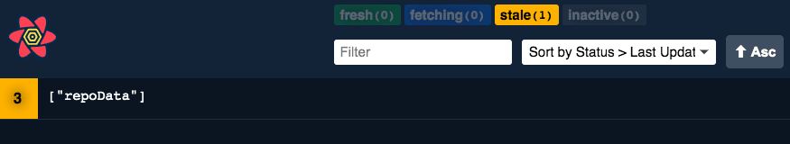

# Заполнители и начальные данные в React Query

## Сходства {#similarities}
### На уровне кэша {#on-cache-level}
### На уровне наблюдателя {#on-observer-level}



## Различия {#differences}
### Персистентность {#persistence}
### Фоновое извлечение данных {#background-refetches}
### Error transitions {#error-transitions}
## Когда что использовать {#when-to-use-what}

Как всегда, это полностью зависит от вас. Лично мне нравится использовать `initialData` при предварительном заполнении запроса из другого запроса, а для всего остального я использую `placeholderData`.


```ts title="pre-filtering" hl_lines="17-26"
type State = 'all' | 'open' | 'done'
type Todo = {
  id: number
  state: State
}
type Todos = ReadonlyArray<Todo>

const fetchTodos = async (state: State): Promise<Todos> => {
  const response = await axios.get(`todos/${state}`)
  return response.data
}

export const useTodosQuery = (state: State) =>
  useQuery({
    queryKey: ['todos', state],
    queryFn: () => fetchTodos(state),
    initialData: () => {
      const allTodos = queryClient.getQueryData<Todos>([
        'todos',
        'all',
      ])
      const filteredData =
        allTodos?.filter((todo) => todo.state === state) ?? []

      return filteredData.length > 0 ? filteredData : undefined
    },
  })
```


<small>:material-information-outline: Источник &mdash; [https://tkdodo.eu/blog/placeholder-and-initial-data-in-react-query](https://tkdodo.eu/blog/placeholder-and-initial-data-in-react-query)</small>
